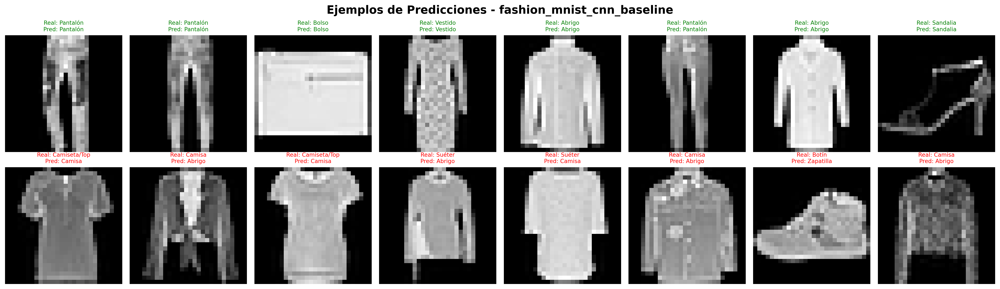
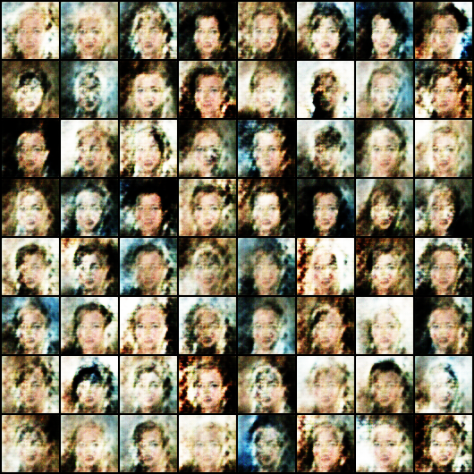
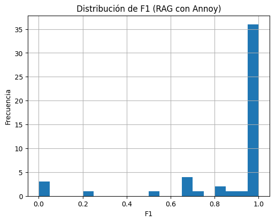
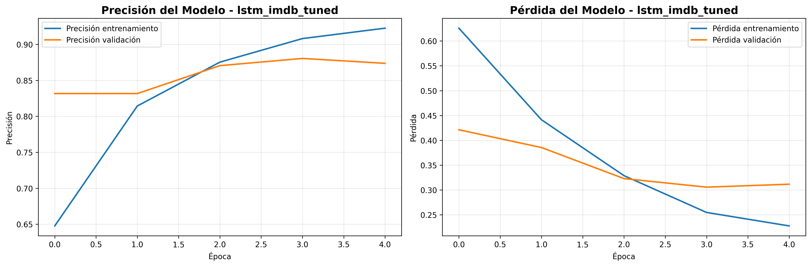

# Proyecto 1 — CNN con Fashion-MNIST  

## 📌 Resumen ejecutivo  
Entrené una CNN para clasificar ropa con el dataset **Fashion-MNIST**.  
Con 10 épocas logré **92.2% de accuracy** y **92.2% de F1 Score**. El modelo anda muy bien en clases fáciles como pantalones y bolsos, pero se complica un poco con camisas y camisetas.  

## 📝 Problema y dataset  
- **Problema:** reconocer 10 tipos de prendas.  
- **Dataset:** Fashion-MNIST (70k imágenes 28x28 en escala de grises).  

## ⚙️ Metodología  
- **Arquitectura:** CNN con 4 capas conv + BatchNorm y Dropout.  
- **Entrenamiento:** Adam, lr=0.001, batch=64, 10 épocas.  
- **Recursos:** corrido en CPU común.  

## 📊 Resultados  
- Accuracy: **92.2%**  
- F1 Score: **92.2%**  
- Tiempo: ~1242s  
- Parámetros: ~470k  

Fortalezas: pantalón, bolso y sandalia casi perfectos.  
Debilidades: confusión entre camisa y camiseta.  

## 📚 Lecciones aprendidas  
- BatchNorm + Dropout ayudan bastante.  
- Ver métricas por clase muestra dónde se equivoca.  

## 🚀 Trabajo futuro  
- Probar **data augmentation**.  
- Ajustar hiperparámetros.  
- Usar **modelos preentrenados** para comparar.  

## 📊 Visualización

---
# Proyecto 2 — DCGAN (CelebA)

## 📌 Resumen ejecutivo  
Entrené un **DCGAN** para generar rostros usando el dataset **CelebA**. El modelo tiene un **generator** y un **discriminator** entrenados con imágenes reales de 64x64.  
Después de 5 épocas, las imágenes generadas todavía no son muy nítidas, pero muestran formas de caras.  

## 📝 Problema y dataset  
- **Problema:** generar imágenes sintéticas de rostros que se parezcan a los reales.  
- **Dataset:** CelebA (caras de famosos, recortadas a 64x64).  

## ⚙️ Metodología  
- **Arquitectura:**  
  - Generator: 3.57M parámetros  
  - Discriminator: 2.76M parámetros  
  - Latent vector z = 100  
- **Entrenamiento:**  
  - Épocas: 5  
  - Batch size: 64  
  - Learning rate: 0.0002  
- **Recursos:** entrenado en CPU estándar (tardó ~1725s).  

## 📊 Resultados 
- **Pérdida Generator (G):** 7.94  
- **Pérdida Discriminator (D):** 0.60  
- **Tiempo total:** ~1726s  

**Observaciones:**  
- El modelo aprendió formas básicas de caras.  
- Aún le falta nitidez y detalle.  
- Se necesita más entrenamiento y tal vez más filtros.  

## 📚 Lecciones aprendidas  
- Entrenar GANs es más lento y menos estable que CNNs.  
- El balance entre G y D es clave (si uno gana mucho, el otro falla).  
- Las métricas clásicas (accuracy, F1) no sirven: se usa la pérdida y visualización.  

## 🚀 Trabajo futuro  
- Entrenar más épocas mi compu ya no daba para masss 😭😭😭😭😭😭.  
- Usar GPU para mejorar velocidad.  
- Probar métricas como **FID** para evaluar calidad de las imágenes.  
- Usar arquitecturas más modernas (StyleGAN, WGAN-GP).  

## 📊 Visualización

---
# Proyecto 3 — RAG con SQuAD pequeño  

## 📌 Resumen ejecutivo  
Implementé un **sistema RAG** para responder preguntas usando un subset del dataset **SQuAD v1.1**.  
El sistema usa **embeddings MiniLM-L6-v2**, un **índice Annoy (angular)** para búsqueda, y un **modelo lector roberta-base-squad2**.  
En 200 ejemplos alcanzó **72% EM** y **87% F1**.  

---

## 📝 Problema y dataset  
- **Problema:** responder preguntas a partir de contextos de texto.  
- **Dataset:** subset pequeño de SQuAD v1.1 (200 ejemplos).  

---

## ⚙️ Metodología  
1. Crear embeddings de los contextos con MiniLM.  
2. Usar **Annoy** para recuperar los pasajes más parecidos.  
3. Aplicar el modelo QA (roberta-base-squad2) para extraer la respuesta.  
4. Evaluar con Exact Match (EM) y F1.  

---

## 📊 Resultados  
- **Exact Match (EM):** 72%  
- **F1 Score:** 87%  
- **Tiempo total:** ~47.7s  
- Ejemplos guardados en: `results/3_rag_qa/examples.csv`  

📈 La distribución de F1 muestra que la mayoría de respuestas están cerca de 1.0, aunque hay algunos casos con F1 bajo.  

---

## 📚 Lecciones aprendidas  
- Con Annoy el sistema recupera rápido y bastante bien.  
- **F1 es más representativo que EM** porque cuenta respuestas parciales.  
- Todavía aparecen respuestas incompletas en algunos ejemplos difíciles.  

---

## 🚀 Trabajo futuro  
- Probar **FAISS** en lugar de Annoy.  
- Usar **embeddings más grandes** o especializados.  
- Testear con **documentos propios** (FAQs o PDFs).  

## 📊 Visualización

---
# Proyecto 4 — LSTM con IMDB  

## 📌 Resumen ejecutivo  
Entrené una **red LSTM bidireccional** para clasificar reseñas de películas (IMDB, positivo/negativo).  
El modelo usa **Embedding + SpatialDropout + LSTM con Dropout**.  
Con 5 épocas alcanzó **86.5% de accuracy** en test y **86.6% de F1 Score**.  

## 📝 Problema y dataset  
- **Problema:** clasificar reseñas de texto como positivas o negativas.  
- **Dataset:** IMDB reviews (ya tokenizado, 25k train / 25k test).  

## ⚙️ Metodología  
- **Arquitectura:**  
  - Embedding  
  - SpatialDropout1D  
  - Bidirectional LSTM (96 unidades)  
  - Capa densa sigmoide  
- **Entrenamiento:**  
  - 5 épocas  
  - Adam (lr=0.0005)  
  - Batch = 128  
- **Recursos:** CPU estándar.  

## 📊 Resultados  
- **Accuracy test:** 86.5%  
- **F1 Score test:** 86.6%  
- **Loss test:** 0.3245  
- **Parámetros:** ~2.73M  
- **Matriz de confusión:** buena precisión en ambas clases, con algo más de falsos negativos.  

## 📚 Lecciones aprendidas  
- Regularización con Dropout y EarlyStopping ayudan a reducir overfitting.  
- El **F1 Score** refleja mejor el balance entre positivo y negativo que solo accuracy.  

## 🚀 Trabajo futuro  
- Probar **GRU** o **Transformers** para mejorar performance.    
- Extender a **clasificación multi-clase** o análisis más fino de sentimiento.  

  ## 📊 Visualización

# Proyecto 5 — Transformer con IMDB  

## 📌 Resumen ejecutivo  
Entrené un modelo **DistilBERT** para clasificar reseñas de películas como positivas o negativas.  
Con 2 épocas de entrenamiento en un subset pequeño del dataset IMDB, logré **90.5% de accuracy** y **90.5% de F1 Score**.  

---

## 📝 Problema y dataset  
- **Problema:** análisis de sentimiento en reseñas de películas.  
- **Dataset:** IMDB reviews (usé un subset para que sea más rápido en mi PC).  

---

## ⚙️ Metodología  
- **Modelo:** `distilbert-base-uncased` (transformer liviano).  
- **Entrenamiento:**  
  - Épocas: 2  
  - Batch size: 8  
  - Learning rate: 2e-5  
- **Recursos:** CPU común, entrenamiento más lento (~4 horas).  

---

## 📊 Resultados  
- **Accuracy test:** 90.5%  
- **F1 Score test:** 90.5%  
- **Loss test:** 0.2395  
- **Parámetros:** ~66M  
- **Tiempo total:** ~14,358s (≈ 4h)  

📈 Gráficos guardados en `../results/5_transformer/`:  
- `training_loss.png`  
- `confusion_matrix.png`  
- `examples.csv` (predicciones correctas e incorrectas).  

Ejemplo correcto:  
✅ *This movie is fantastic!* → Positiva (predicho bien)  

Ejemplo incorrecto:  
❌ *I didn’t like the story at all* → Positiva (predicho mal)  

---

## 📚 Lecciones aprendidas  
- Los Transformers son muy potentes, pero **entrenar en CPU es lento**.  
- El F1 es más representativo que solo accuracy.  
- Guardar curvas y ejemplos ayuda a explicar el modelo.  

---

## 🚀 Trabajo futuro  
- Probar con GPU para acelerar el entrenamiento.  
- Usar `bert-base-uncased` o `roberta-base` para comparar.  
- Extender a multi-clase (más matices de sentimientos).  
- Extender a **clasificación multi-clase** o análisis más fino de sentimiento.

